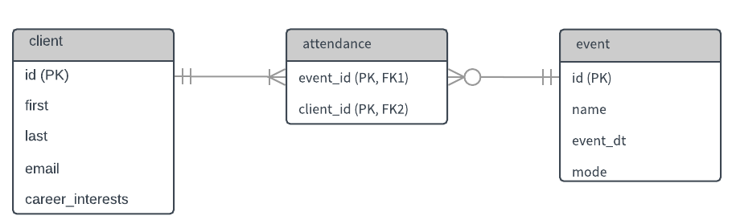

Just like in our [Create Table](../basictable/) course, we'll consider a 
particular business scenario, build out our data structure, and use array, 
range, and enumerated (aka enum) types in our examples.

### Scenario: Career counseling agency

Extra Mile Counseling offers career counseling and coaching services to young 
professionals. They have two counselors onsite in their Portland, Oregon 
headquarters, and four other remote counselors across the United States and 
Canada.

Many of Extra Mile's clients work individually with a career counselor over a 
certain time period, but Extra Mile also hosts other events that are open 
to the public for registration. A few of their most popular events are: 
30-minute one-on-one consultations, résumé and cover letter group workshops,
 and job search strategy workshops.

Extra Mile Counseling needs a way to track their events, event attendance, and 
clients. Any one-on-one meeting with a counselor is considered an "event," as 
are group meetings and workshops. Anyone who attends an event is considered a 
"client," regardless of whether they work with an individual career counselor 
on a regular basis, or have only ever attended one event.  

### Data structure

Since we're focusing on a few specific data types, we'll work with an 
"incomplete" data structure, i.e. it will display only a few tables, 
relationships, and columns that serve the purpose of this course.

_PK_ and _FK_ indicate primary keys and foreign keys respectively. The _attendance_
 table has a _composite_ primary key comprised of its two columns.

The main concepts to derive from this data model are:
* All clients have attended at least one event.
* Each instance of _attendance_ is associated with exactly one event and one 
client only.
* An event can have zero (for example, if registration hasn't been opened yet),
 one, or many attendees.

 Again, we'll keep it to a very simple data structure for this course, but 
 you may already realize some of the things it lacks. For example, we 
 haven't included a table for career counselors. Also, in the real world, these
  three tables will likely need more fields. Planning and implementing a 
  database design is typically a rather involved exercise, taking into account 
  many business rules and processes.

### What we'll focus on

These are the fields we'll use to learn about array, range, and enum types:

a. client table: `career_interests` - array

b. event table: `event_dt` - range

c. event table: `mode` - enum

For the purposes of this course, we won't actually need the attendance table, 
so we won't build it this time. With that said, this kind of "intersection" 
table is common in relational database design.

 >**Note:**
 >
 >You may encounter entity relationship diagrams (ERD) or data models that look 
 different from the one we're using here. There are many ways to illustrate how
 objects in a database are related to each other. (Here's a quick two-part 
 [video series](https://www.youtube.com/watch?v=QpdhBUYk7Kk) on ERDs if you'd 
 like to learn more about creating them.)
