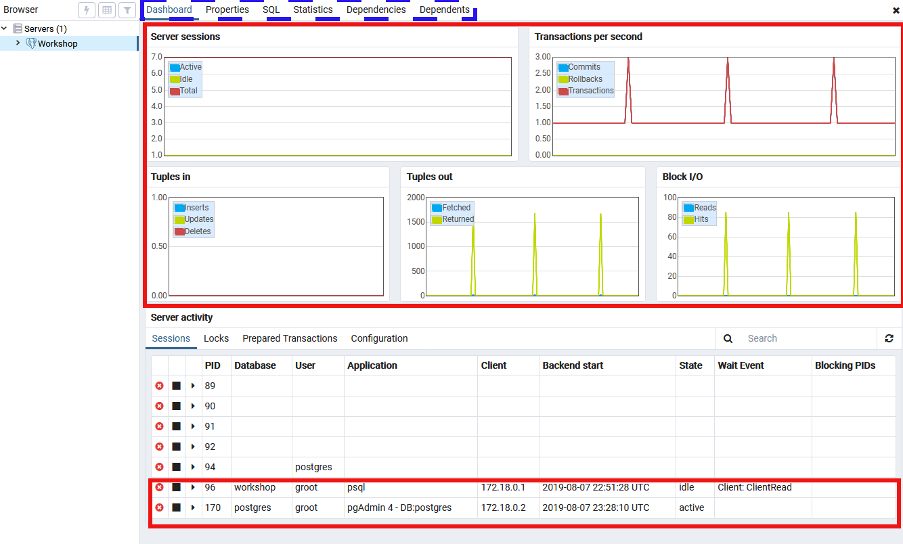
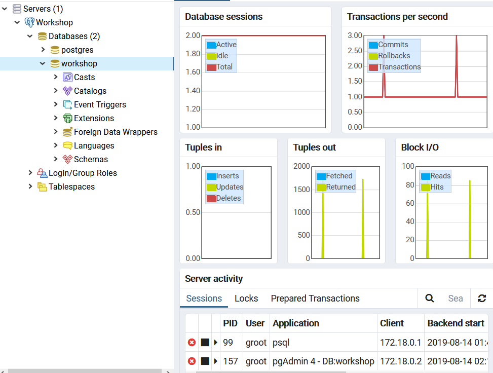
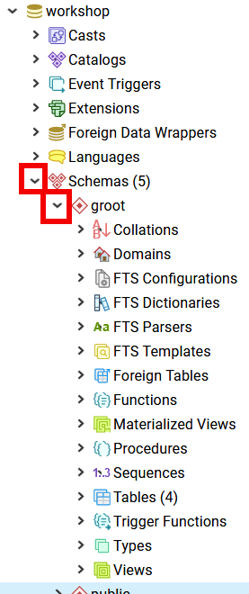
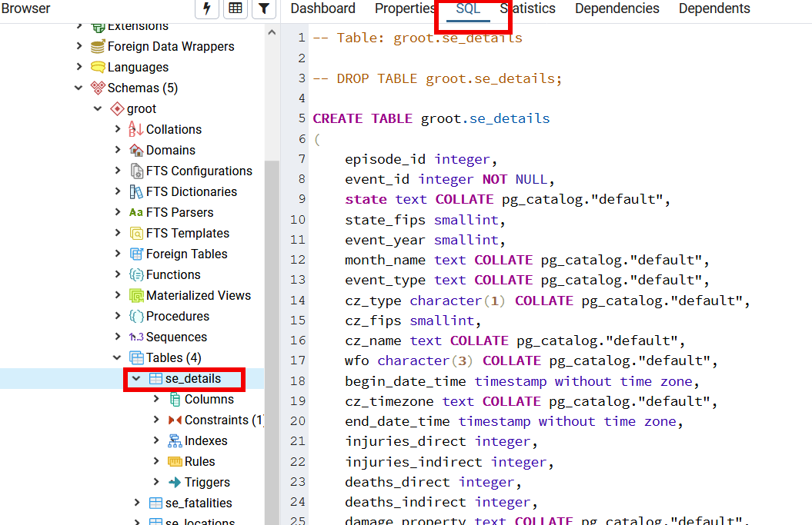

# Navigating Around Your Database Using PgAdmin4

Now that we have our shiny new connection to our server let's explore how to use PgAdmin to navigate around.

## Top Level

Go ahead and click on the Workshop server in the left nav bar. Your right hand pane should transform to something that looks 
like this (without the red highlight boxes):

The top highlighted area shows you statistics on your current server for all the current sessions connected to the server. 
The bottom area shows you all the current running Postgres processes (PID = process ID), and if applicable, information 
about the database and user who is associated with the process.

The blue dashed box along the top highlights other tabs that apply to the current item selected in the left nav. 

In this case, there is not much interesting information on those tabs so we will wait until later to explore them.    

## Finding Our Database

Alright time to dig in and find our actual database which is named "workshop". 

>To open the connection, click on the little arrow next to the elephant with the word Workshop after it, then click on little arrow next to **Databases**. 

You should see two databases, postgres and workshop (capitalization matters in PostgreSQL). The postgres database is gold in color which means you are connected, while our workshop database is grey and has an red X through it, meaning we are not connected. 

 > Let's go ahead and click on the **workshop** icon. 
 

The left side now allows you to see and navigate to all the objects in your database. The right side is now just showing you the stats 
for this database, not the whole server. 

### Finding Our Tables (and Schemas)

Your most common thing to view or edit will probably be tables so let's go find our tables. 

Before we go let's quickly talk about PostgreSQL schemas. In PostgreSQL, [https://www.postgresql.org/docs/11/ddl-schemas.html](schema) is a way to namespace 
database objects. You can also think of schemas as directories in an operating system. You can use them to avoid naming collisions
between objects like tables, to do more differentiated permissions, and 3rd party apps can place their objects in the database 
without causing problems.

By default, all PostgreSQL databases have a public database. If you create an object without a schema qualification it will be 
 created in the public schema. If you create a schema for your username name then objects you create will be placed in your 
 schema by default.  If you are interested in the mechanics behind this read the documentation link above. 
 
 If you look at our DB initialization script
 
 https://github.com/CrunchyData/crunchy-containers/blob/master/bin/postgres-appdev/setup.sql#L35
 
 You will see that in the workshop database we create a schema with our username. Therefore, to find the objects we need 
 to navigate into our schema _groot_ first.
 
 
 
 Now you can see all the different objects that can be contained within a schema. 
 
 To find our tables go ahead and expand the table item in the left navigation tree. You will see four tables, one created 
 by the initialization script, named _testtable_, and three others with storm information for the United States. 
 
 > Go ahead and click on _se_details_ and then click on the top SQL tab. You should now see the DDL statements to create this table.
 

 

## Wrap Up

With that we have covered the basics of navigation around your database server in PgAdmin4. There is a lot of exploration 
you should do to see how things work. I highly recommend you click around and explore some before going on to the next 
exercise. 

Let's move on to doing SQL in PgAdmin4!

