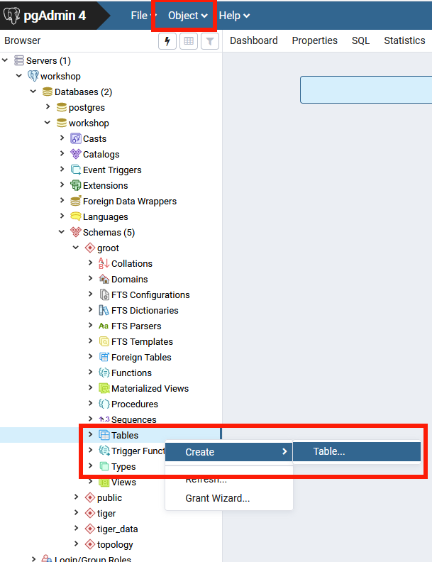
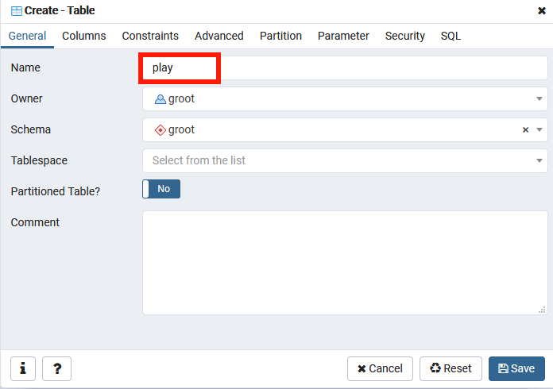
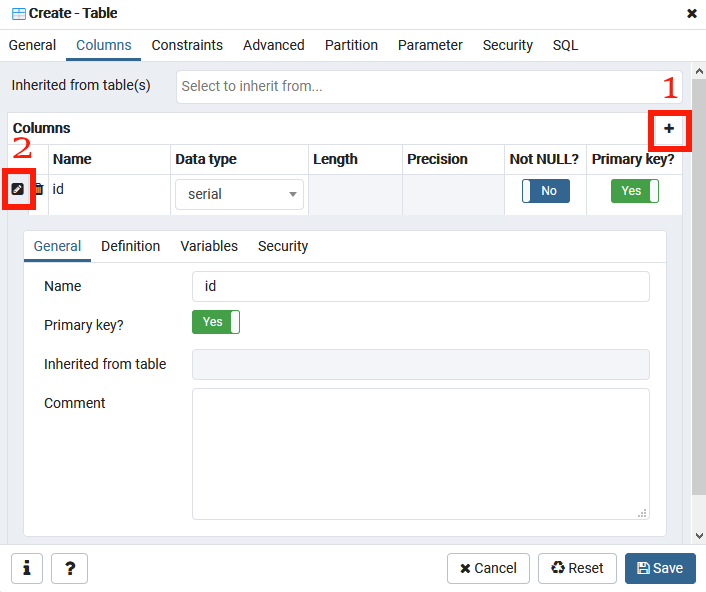

# Creating objects in the database 
For this final section we are going to cover creating and editing objects in the database using PgAdmin4.
As per usual in PgAdmin4, there are several ways to achieve this. 

One way to create an object is to bring up the query interface and just execute some DDL/SQL. Since we talked about this in the last section I am not going to cover it here.

## Creating a table

Make sure you select the table icon inside the schema where you want the table created. 

>Then either click on the _Object_ menu on the very top menu bar or right click on the table item in the left nav bar. Then chose _Create_

 

This will will bring up the create table dialog.

> On the first tab please call the table "play".  

You will notice it is placed in your schema and you will be the owner by 
default. 

### Adding the primary key

Now click on the second tab to add columns. Let's start with our primary key field named _id_.

 
> 1. Click on the + symbol on the right hand side (labeled with a red 1).  
> 2. because we are creating a primary key we need to click on the pencil icon on the left to bring up the extended creation dialog (labeled with a red 2).
> 3. After that name the column _id_ then click the slider for primary key.  
>4. To make the column type = _serial_ you can either 
edit the type back in the original row or click on the sub tab for definition. 
>Once you click in that field you can start typing serial and it will narrow the list.

### Adding a second column

To add a second column 
> go ahead and click on the plus icon again. This time we can do all our work on the line so there is no 
need to click the pencil icon. Just name the column _discussion_ and make it _text_  

And with that we are done.

> Click on the **Save** icon on the bottom.

You can now inspect your table in the left nav and see that all the objects under the table were automatically created for you. 

You can also now go in and edit the table definition by right clicking on the table and then selecting **Properties**.

This brings back  the same dialog as above allowing you to edit the definition of the table.

## Wrap Up

The pattern we used here can be used with all the objects you see in your left navigation. 

Even if you don't usually use the GUI to create database objects, the SQL view in PgAdmin4 can be helpful to give you a head start on where you might 
want to start.

Before clicking the "Continue" button below, you should explore and play more with the interface.

Try to figure out
1. How to add a function
1. Look at the users in the database server
1. Try some some more of the right click actions on a table
1. Look at more detailed information for an index