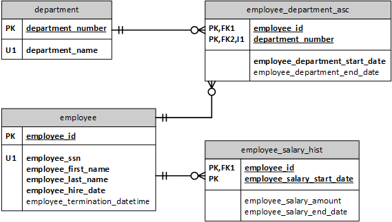

# Create table in PostgreSQL

The goal of this tutorial is to introduce you to basic concepts of the PostgreSQL `CREATE TABLE` statement using a simple business scenario. In this tutorial, you will learn to :

- Create simple tables with basic data types.
- Create basic constraints: primary key, foreign key and check constraint.

## Our business scenario

John Smith, Mary Smith, Arnold Jackson, and Jeffery Westman are employees of a particular company. Each employee is identified by their SSN and employee ID. 

John works in Sales, Mary works in Research, and Arnold and Jeffery work in Accounting. There are other departments that do not currently have employees, and there are yet other employees that have not yet been associated with a department. All departments have a unique department number which is auto-generated every time a new department is added.

The current payroll system captures salary history of all employees, and all salaries are greater than 1000 dollars.

Below is the data model that depicts the business scenario. Typically, we use nouns to identify tables, and verbs for relationships, especially when modeling a business scenario like above.

In this tutorial, you'll use psql to interact with a PostgreSQL database.  You'll use the following credentials to connect to the workshop database:

1. Username: groot
1. Password: password (same password for the postgres user as well)
1. A database named: workshop

 Let's get started.
