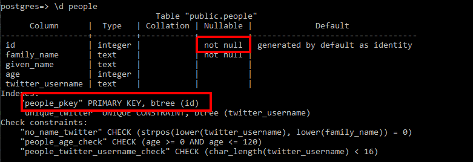

# Primary Keys and Foreign Keys

## Introduction
While you may not immediately think of primary keys and foreign keys as constraints, designating columns as keys automatically creates constraints on the columns. Both of these columns types are used to enforce a unique identifier per row and  referential integrity between tables.

## Primary Key 

When you designate a column as a primary key, like we did with our _id_ column in the first exercise, we are stating that the value in this column MUST be unique to each row. The value has to be unique because the primary key is the way you can  guarantee the row you want. To ensure this condition, PostgreSQL creates a unique b-tree index for the primary key. To also ensure that each row has a referencable id we also need a not null constraint on the column, which PostgreSQL does automatically. So if we describe our table again:

```sql92
\d people
```{{execute}}

You can see this work that Postgres did behind the scenes:



All we had to do was declare a column as a primary key and we get a _unique_ and _not null_ constraint.  

## Foreign Key

The foreign key constraint is a bit different than the other constraints we have covered. With a foreign key constraint, when we enter a value for the foreign key column, it actually checks to make sure that value exists as a primary key in the related table (the parent table). Having this constraint prevents us from entering data in our table (the child table) that has a non-existent relationship with a table that is supposed to be related. Another benefit of a foreign key constraint is that it can prevent you from deleting data in a parent table if there is still related data in the child table. Yet another way to keep your data nice and clean!

Let's create a child table of _team\_role_ that describes the role and time period for each person. 

```sql92
create table team_role (
    id          integer PRIMARY KEY GENERATED BY DEFAULT AS IDENTITY,
    name        text,
    role_dates  daterange,
    people_id   integer REFERENCES people (id)

);
```{{execute}} 

Of course, following good database design we have a primary key, _id_. Then we have a name for the team role, _role_, along with a date span for when the person had the role, _role_dates_. Finally, we add a foreign key back to the parent _people_ table with the column _people\_id_.

Now let's define a role for ~~Starlord~~ Peter Quill. To begin let's get his people table id:

```sql92
select * from people;
```{{execute}} 

Now let's insert a role for him:

```sql92
insert into team_role (name, role_dates, people_id)  values ('mixtape master', '[2000-01-01, 2012-12-31]' , 2);
```{{execute}}

This should go through fine. We just said Peter Quill was mixtape master from Jan 1, 2000 until Dec 31, 2012. 

In my _people_ table I have no _id_ 50 yet, so if I try to make an entry for people_id 50 I get:

```sql92
insert into team_role (name, role_dates, people_id)  values ('graphic novel writer', '[2000-01-01, 2012-12-31]' , 50);
```{{execute}}

Gives me:

```
[23503] ERROR: insert or update on table "team_role" violates foreign key constraint "team_role_people_id_fkey"
Detail: Key (people_id)=(50) is not present in table "people".
```

And if I try to delete Peter Quill from the original table

```sql92
delete from people where id = 2;
```{{execute}}
I get:

```
[23503] ERROR: update or delete on table "people" violates foreign key constraint "team_role_people_id_fkey" on table "team_role"
Detail: Key (id)=(2) is still referenced from table "team_role".
```

There are [many ways](https://www.postgresql.org/docs/12/sql-createtable.html) (search for FOREIGN KEY  on the page) to set up your foreign keys so that PostgreSQL can do different behavior when you try to delete a parent table entry with existing child entries but covering that is beyond the scope of this class.

And with that we have covered Primary and Foreign keys. The last scenario will cover our last kind of constraints, _exclusion constraints_. 

