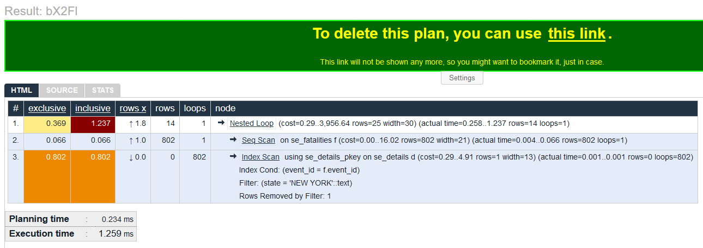
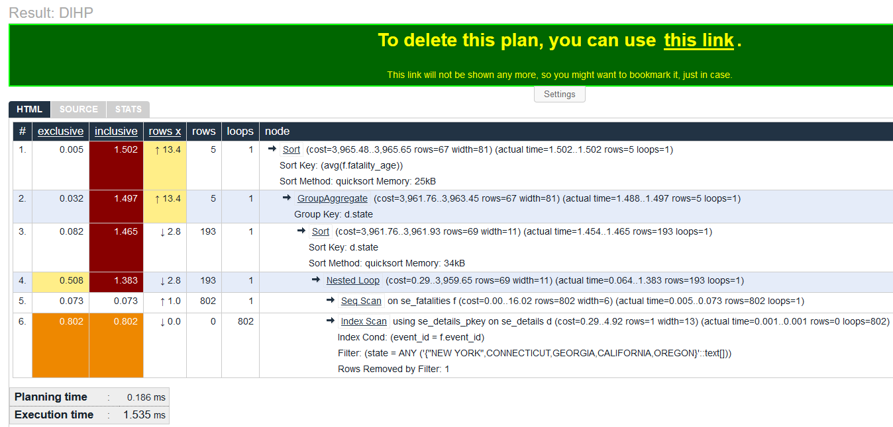

# Other tools to help you with Explain output
https://explain.depesz.com/

If you still feel like reading EXPLAIN output is not the easiest, never fear, there are other tools available to help you visualize and work with the output. In this section we will cover one of the most popular web-based tools that is often referenced by many in the PostgreSQL community. 

## Web tool for analyzing EXPLAIN results

The site we are going to use today is [https://explain.depesz.com/](https://explain.depesz.com/). It is run by two community members for free to the PostgreSQL community. By default, it's visualization on the site will be shared publicly but you can turn that off and you can also obfuscate variable names. One of the nice features of the map is that it will provide a permalink to the output that you can share with others to view your EXPLAIN results.
 
 Go ahead and click the link above and it will open in a new tab.

### Filling in the form
 
 If you want, go ahead and put a name in the *title* . 
  
 Now you are going to copy the explain output from our last exercise into the box where it says to paste your query. Here is the output if you no longer have the results in your console window:
 
 ``` 
                                                             QUERY PLAN
---------------------------------------------------------------------------------------------------------------------------------------
 Nested Loop  (cost=0.29..3956.64 rows=25 width=30) (actual time=0.258..1.237 rows=14 loops=1)
   ->  Seq Scan on se_fatalities f  (cost=0.00..16.02 rows=802 width=21) (actual time=0.004..0.066 rows=802 loops=1)
   ->  Index Scan using se_details_pkey on se_details d  (cost=0.29..4.91 rows=1 width=13) (actual time=0.001..0.001 rows=0 loops=802)
         Index Cond: (event_id = f.event_id)
         Filter: (state = 'NEW YORK'::text)
         Rows Removed by Filter: 1
 Planning Time: 0.234 ms
 Execution Time: 1.259 ms
```

Then click the submit button.

You should see something like this:




### Explaining the output

Above the output you will see a grey menu bar which contains a 'help' option. We highly recommend reading the help as it is quite good in explaining what you are seeing.

Let's still do a quick run through of the main part of the output.

* The exclusive column is how long that node took on it's own. Note that for our loop, the output actually does the multiplication of row x execution time for us. Also note that this column gives us new information for the parent node. It actually subtracts the child processing steps and gives us the time for the node alone.

* The inclusive column is the same as the last number we get in our textual output for "actual time" output of each node. For loops the output shows the multiplication

* Rows X is the ratio of "actual rows returned/estimated rows to be returned". Best case is what we see in our results, 1. Either much larger or smaller numbers indicate the planner is getting bad information and you may want to run ANALYZE; on your table or database

* The next two columns, rows and loops, are the same as what we see in the textual output

* Node is the node in the tree, like we discussed before. Note that if you mouse over a parent node, all the child nodes will get a star in front of them and if you click on the parent node it will collapse all its child nodes. If you click on the link for the node name, such as "Nested Loop", it will bring you to a web page explaining the concept with a small example.

The red cells indicate the longest inclusive time, which makes sense in this case since the parent node should be the longest running. The orange cells indicate that our index scan is our longest running step. If we wanted to try and improve our query performance this might be a good place to start. For example, we see the index scan is only using the primary key of the se_details column and not the index we created on the state column. If this was a very important query to us, and for some strange reason ~ 1 ms was not fast enough for us, we might make a compound index on the primary key and the state column.

Finally, you can see right above the output there is a blue HTML tab with a source and stats table in grey. If you click on the stats tab in grey you get a nice view of the stats broken down by node and by table. It's a quick and easy way to see where your query is spending most of it's time.

### A query that really benefits from the graphical interface

So while our output was not so complicated to require the graphical interface, let's make our query do a bunch more work and see what happens. How about finding the average age and counts of fatalities in U.S. states I have lived in for more than 2 weeks, sorted by average age:

```sql
 EXPLAIN ANALYZE select avg(f.fatality_age), count(d.state), least(d.state) as state
from se_details as d, se_fatalities as f where d.event_id = f.event_id AND d.state in ('NEW YORK', 'CONNECTICUT', 'GEORGIA', 'CALIFORNIA', 'OREGON') group by d.state ORDER by avg;
```

Now take that output and put it in the web site:



Having the exclusive column allows us to see that, for this query, the join is still the most expensive part of the operation. But it also allows us to quickly glean some of the more important information without having to try and visually parse through all the detailed textual statistics.

## Wrap Up

We highly recommend you go through and come up with some other queries and try looking at them with EXPLAIN, especially ones that seem to be giving you problems.  We hope you have found EXPLAIN ANALYZE to be a helpful tool for you in learning more about what PostgreSQL is doing when it executes your query. If you continue to use it, it will also help you write better SQL and understand where the real bottlenecks are. 

This was merely an introduction to EXPLAIN ANALYZE, there is a lot of content in the world to help you dig in deeper. Here are some of our favorites:

* The explanatory doc on [using explain](https://www.postgresql.org/docs/current/using-explain.html) from the PostgreSQL web site
* The [blog series](https://www.depesz.com/tag/unexplainable/) from the EXPLAIN.depesz.com people
* A really nice [video introduction](https://www.youtube.com/watch?v=mCwwFAl1pBU) from Josh Berkus
* Stephen Frost explaining how to [use EXPLAIN](https://www.youtube.com/watch?v=yhOkob2PQFQ) to identify and fix slow queries
* The PostgreSQL wiki has a good collection of [EXPLAIN resources](https://wiki.postgresql.org/wiki/Using_EXPLAIN) as well

