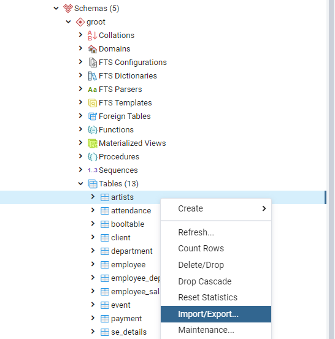
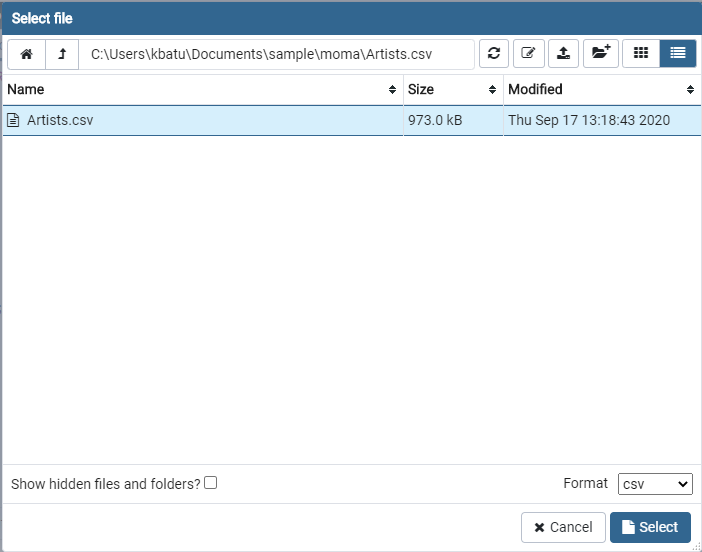

GUI clients like pgAdmin also have data import capabilities. In pgAdmin4, we use the Import/Export Data tool to load or export data between files and Postgres tables.

The Import/Export Data dialog only provides access to the file system of the 
pgAdmin host. That means you won't be able to import files from your local 
machine if you are connecting to pgAdmin on a remote host. Due to the 
limitations of the learning portal environment we won't be doing a hands-on 
import via pgAdmin, but we'll illustrate the major steps below where pgAdmin is
 running on a local machine.

## Import the Artists dataset with pgAdmin4

1. In the pgAdmin browser on the left-hand side, navigate to the database and 
schema where the `artists` table is located.
2. Right-click on the table and select _Import/Export..._  

3. In the Import/Export data dialog, toggle the "Import/Export" switch so that it displays "Import."  

4. Type in the absolute path of the file you want to load, or click the Browser
 (ellipsis) button, and navigate to the file by double-clicking on a directory.  

5. Back in the Import dialog, the configuration here just matches the arguments
 we used with `\copy`:
    - Format: csv
    - Header: Yes
    - Quote: "  
The remaining can be left at the default setting.  

6. In the Import dialog, navigate to the "Columns" view. The "Columns to 
import" field will display all table columns, but in this case the `id` column 
doesn't exist in the file, so we remove it from the list as we're not importing
 to it.  

7. Select OK. A notification window will appear on the bottom corner of the 
pgAdmin interface indicating that the import successfully completed.
8. To check the table data, right-click on the `artists` table again and with _View/Edit Data_, select _First 100 Rows_.  
The table data grid will be displayed, with the corresponding query syntax in 
the Query Editor.  
  
Alternatively, you can also write and execute a SELECT query by clicking _Tools_ from the top navigation menu and selecting _Query Tool_.

For more information on the Import/Export tool, refer to the [official pgAdmin4 documentation](https://www.pgadmin.org/docs/pgadmin4/latest/import_export_data.html).

We also have a [Basic Introduction to pgAdmin4](https://learn.crunchydata.com/postgresql-devel/courses/basics/basicpgadmin) available here in our Learning Portal.
 